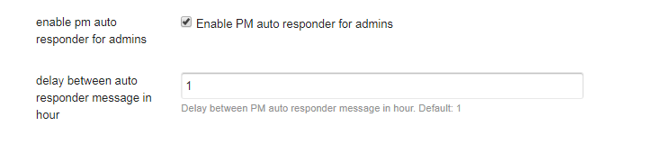
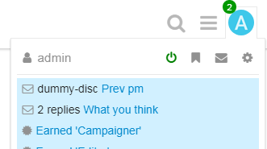
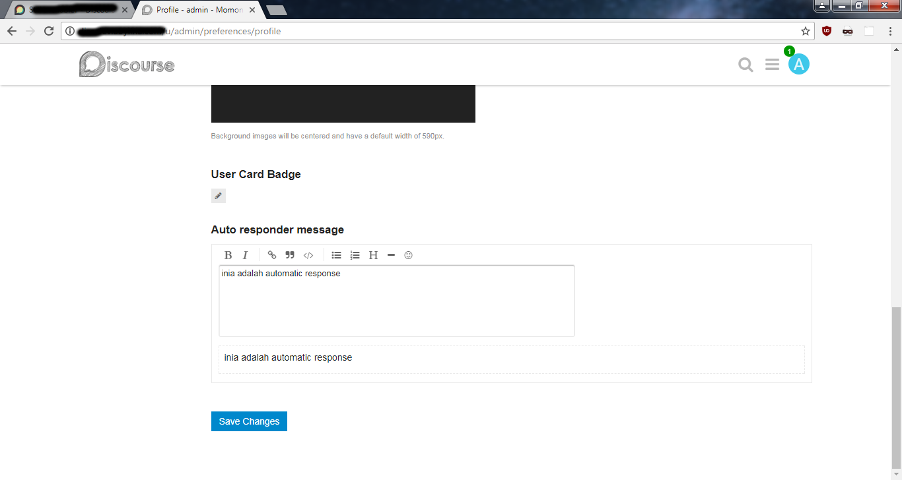
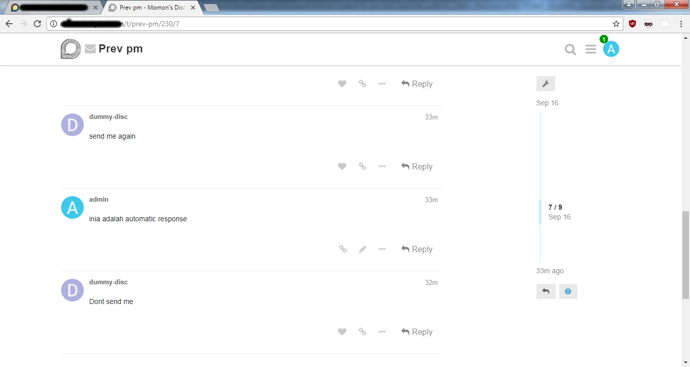

# Discourse Private Message Auto Responder For Admins

Thanks to @WorldIsMine for sponsoring this work.

## Screenshot

Admin can set auto-responder ON / OFF by clicking the icon (green means ON).

Each admins can set their own auto-responder message.

